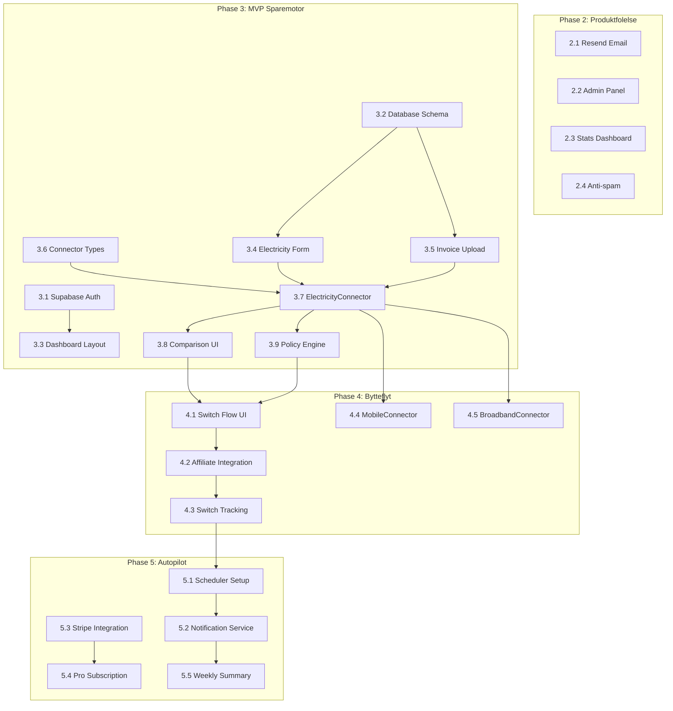

# SmartBytt Phased Implementation Plan

This plan breaks down the SmartBytt platform into assignable work chunks. Tasks within each phase can often be parallelized, while phases generally depend on previous phases.

## Dependency Graph

---

## Phase 2: Produktfolelse (Week 1-2)

**Goal**: Admin tools, email confirmation, stats, anti-spam. All tasks can be parallelized.

### 2.1 Confirmation Email (Resend)

- **File**: `app/api/waitlist/route.ts` (modify), `lib/email/index.ts` (new)
- **Scope**: 
  - Install Resend SDK
  - Create email template for waitlist confirmation
  - Send confirmation on successful waitlist signup
  - Add RESEND_API_KEY to environment
- **Estimate**: 2-3 hours
- **Parallelizable**: Yes (independent)

### 2.2 Admin Panel - Layout and Auth

- **Files**: `app/admin/layout.tsx`, `app/admin/page.tsx`, `middleware.ts`
- **Scope**:
  - Create `/admin` route group with layout
  - Add basic auth protection (env-based password or Supabase admin check)
  - Dashboard shell with sidebar navigation
- **Estimate**: 3-4 hours
- **Parallelizable**: Yes (independent)

### 2.3 Admin Panel - Waitlist Management

- **Files**: `app/admin/waitlist/page.tsx`, `app/api/admin/waitlist/route.ts`
- **Scope**:
  - List all waitlist entries with pagination
  - Search by email
  - Export to CSV
  - Delete entries
- **Estimate**: 3-4 hours
- **Depends on**: 2.2

### 2.4 Admin Panel - Stats Dashboard

- **Files**: `app/admin/page.tsx`, `app/api/admin/stats/route.ts`
- **Scope**:
  - Total signups count
  - Signups per day/week chart
  - Source breakdown (landing, referral, etc.)
- **Estimate**: 2-3 hours
- **Depends on**: 2.2

### 2.5 Anti-spam Protection

- **Files**: `app/api/waitlist/route.ts`, `lib/rate-limit.ts`
- **Scope**:
  - Add honeypot field to WaitlistForm
  - Implement rate limiting (IP-based, 5 requests/minute)
  - Block disposable email domains
- **Estimate**: 2-3 hours
- **Parallelizable**: Yes (independent)

---

## Phase 3: MVP Sparemotor (Week 3-6)

**Goal**: User auth, database, dashboard, electricity comparison. Has sequential dependencies.

### 3.1 Supabase Auth Setup

- **Files**: `lib/supabase/client.ts`, `lib/supabase/server.ts`, `middleware.ts`, `app/(auth)/login/page.tsx`, `app/(auth)/register/page.tsx`
- **Scope**:
  - Configure Supabase Auth with email/password
  - Create auth middleware for protected routes
  - Build login/register pages with forms
  - Add auth context provider
- **Estimate**: 4-6 hours
- **Parallelizable**: Yes (can run parallel with 3.2)

### 3.2 Database Schema Migration

- **Files**: `supabase/migrations/001_initial_schema.sql`, `lib/supabase/types.ts`
- **Scope**:
  - Create all tables from PLAN.md schema (profiles, categories, providers, offers, user_contracts, documents, recommendations, switches, notifications)
  - Set up Row Level Security policies
  - Generate TypeScript types from schema
  - Seed initial categories and test providers
- **Estimate**: 4-5 hours
- **Parallelizable**: Yes (can run parallel with 3.1)

### 3.3 User Dashboard Layout

- **Files**: `app/dashboard/layout.tsx`, `app/dashboard/page.tsx`, `app/components/dashboard/Sidebar.tsx`, `app/components/dashboard/Header.tsx`
- **Scope**:
  - Create authenticated dashboard layout
  - Sidebar with category navigation (Strom, Mobil, Bredband)
  - Header with user menu and notifications bell
  - Overview page with savings summary cards
- **Estimate**: 5-6 hours
- **Depends on**: 3.1

### 3.4 Electricity Input Form

- **Files**: `app/dashboard/strom/page.tsx`, `app/components/forms/ElectricityForm.tsx`
- **Scope**:
  - Form fields: postal code, yearly consumption (kWh), current provider, current price type, monthly fee
  - Postal code to price area mapping (NO1-NO5)
  - Form validation with error messages
  - Save to user_contracts table
- **Estimate**: 4-5 hours
- **Depends on**: 3.2, 3.3

### 3.5 Invoice Upload and Parsing

- **Files**: `app/api/upload/invoice/route.ts`, `lib/connectors/electricity/invoice-parser.ts`, `app/components/forms/InvoiceUpload.tsx`
- **Scope**:
  - File upload component (PDF/image)
  - Store in Supabase Storage
  - OCR integration (OpenAI Vision API or similar)
  - Extract: provider name, consumption, price, period
  - Save extracted data to documents table
- **Estimate**: 8-10 hours
- **Depends on**: 3.2

### 3.6 Connector Base Types and Registry

- **Files**: `lib/connectors/types.ts`, `lib/connectors/registry.ts`
- **Scope**:
  - Define BaseConnector interface (collectUserData, fetchOffers, recommend, initiateSwitch)
  - Define Offer, Recommendation, SwitchResult types
  - Create connector registry with getConnector/getAllConnectors
- **Estimate**: 2-3 hours
- **Parallelizable**: Yes (can start early)

### 3.7 Electricity Connector Implementation

- **Files**: `lib/connectors/electricity/index.ts`, `lib/connectors/electricity/api.ts`
- **Scope**:
  - Implement ElectricityConnector class
  - Fetch spot prices (from external API or mock data)
  - Fetch offers from database
  - Calculate monthly cost for each offer
  - Generate recommendation with savings calculation
- **Estimate**: 6-8 hours
- **Depends on**: 3.4, 3.5, 3.6

### 3.8 Comparison UI

- **Files**: `app/dashboard/strom/sammenlign/page.tsx`, `app/components/dashboard/OfferCard.tsx`, `app/components/dashboard/SavingsCard.tsx`, `app/components/dashboard/ComparisonTable.tsx`
- **Scope**:
  - Display current cost vs recommended offer
  - Savings card (monthly, yearly, percentage)
  - List of alternative offers sorted by price
  - Filter by price type (spot/fixed/variable)
  - "Bytt" button (placeholder for Phase 4)
- **Estimate**: 6-8 hours
- **Depends on**: 3.7

### 3.9 Policy Engine (Basic)

- **Files**: `lib/policy-engine/index.ts`, `lib/policy-engine/types.ts`
- **Scope**:
  - evaluateSwitch() function with basic rules
  - Check minimum savings threshold (50 kr/mnd)
  - Check binding period
  - Return SwitchDecision with shouldSwitch, urgency, reasons
- **Estimate**: 4-5 hours
- **Depends on**: 3.7

---

## Phase 4: Bytteflyt og Inntekt (Week 7-10)

**Goal**: Working switch flow with tracking. Partner integration.

### 4.1 Switch Flow UI

- **Files**: `app/components/dashboard/SwitchFlow.tsx`, `app/dashboard/strom/bytt/[offerId]/page.tsx`
- **Scope**:
  - Multi-step switch wizard
  - Confirm current details
  - Show savings summary
  - Terms and consent checkboxes
  - Final confirmation
- **Estimate**: 6-8 hours
- **Depends on**: 3.8, 3.9

### 4.2 Affiliate/Partner Integration

- **Files**: `lib/affiliate/index.ts`, `app/api/switches/route.ts`
- **Scope**:
  - Generate affiliate tracking URLs
  - Handle partner redirects
  - Fallback lead form for non-partner offers
  - Store switch initiation in switches table
- **Estimate**: 5-6 hours
- **Depends on**: 4.1

### 4.3 Switch Tracking

- **Files**: `app/api/switches/[id]/route.ts`, `app/api/webhooks/affiliate/route.ts`, `app/dashboard/bytter/page.tsx`
- **Scope**:
  - Webhook endpoint for affiliate confirmations
  - Update switch status (initiated -> pending -> completed)
  - User view of switch history
  - Commission tracking
- **Estimate**: 5-6 hours
- **Depends on**: 4.2

### 4.4 Mobile Connector

- **Files**: `lib/connectors/mobile/index.ts`, `lib/connectors/mobile/api.ts`, `app/components/forms/MobileForm.tsx`, `app/dashboard/mobil/page.tsx`
- **Scope**:
  - MobileConnector implementing BaseConnector
  - Form: data amount, current price, current provider
  - Fetch mobile offers
  - Comparison page for mobile
- **Estimate**: 6-8 hours
- **Depends on**: 3.6, 3.7 (can parallel with 4.1-4.3)

### 4.5 Broadband Connector

- **Files**: `lib/connectors/broadband/index.ts`, `lib/connectors/broadband/api.ts`, `app/components/forms/BroadbandForm.tsx`, `app/dashboard/bredband/page.tsx`
- **Scope**:
  - BroadbandConnector implementing BaseConnector
  - Form: speed, current price, address
  - Fetch broadband offers by address
  - Comparison page for broadband
- **Estimate**: 6-8 hours
- **Depends on**: 3.6, 3.7 (can parallel with 4.1-4.4)

---

## Phase 5: Autopilot og Abonnement (Week 11-14)

**Goal**: Automated monitoring, notifications, premium tier.

### 5.1 Scheduler Setup (Vercel Cron)

- **Files**: `vercel.json`, `app/api/cron/update-prices/route.ts`, `app/api/cron/find-savings/route.ts`, `lib/scheduler/jobs.ts`
- **Scope**:
  - Configure Vercel Cron jobs
  - Daily price update job
  - Daily savings opportunity check
  - Secure cron endpoints with CRON_SECRET
- **Estimate**: 4-5 hours
- **Parallelizable**: Yes

### 5.2 Notification Service

- **Files**: `lib/notifications/index.ts`, `lib/notifications/templates/`, `app/api/notifications/route.ts`
- **Scope**:
  - NotificationService class
  - In-app notifications (stored in DB)
  - Email notifications via Resend
  - Notification preferences (user settings)
- **Estimate**: 6-8 hours
- **Depends on**: 5.1

### 5.3 Stripe Integration

- **Files**: `lib/stripe/index.ts`, `app/api/stripe/checkout/route.ts`, `app/api/webhooks/stripe/route.ts`
- **Scope**:
  - Stripe SDK setup
  - Create checkout session for Pro subscription
  - Handle Stripe webhooks (subscription created/cancelled)
  - Update user subscription_tier in database
- **Estimate**: 6-8 hours
- **Parallelizable**: Yes (can run parallel with 5.1, 5.2)

### 5.4 Pro Subscription Features

- **Files**: `app/dashboard/pro/page.tsx`, `app/components/dashboard/UpgradeModal.tsx`, `middleware.ts`
- **Scope**:
  - Pro upgrade page with pricing
  - Feature gating (more categories, priority alerts)
  - Subscription management page
  - Cancel subscription flow
- **Estimate**: 5-6 hours
- **Depends on**: 5.3

### 5.5 Weekly Summary Email

- **Files**: `app/api/cron/weekly-summary/route.ts`, `lib/notifications/templates/weekly-summary.tsx`
- **Scope**:
  - Cron job running weekly
  - Aggregate user savings potential
  - Generate personalized email
  - Include recent price changes
- **Estimate**: 4-5 hours
- **Depends on**: 5.1, 5.2

### 5.6 Savings History View

- **Files**: `app/dashboard/historikk/page.tsx`, `app/components/dashboard/SavingsChart.tsx`
- **Scope**:
  - Chart showing savings over time
  - List of completed switches
  - Total savings accumulated
- **Estimate**: 4-5 hours
- **Depends on**: 4.3

---

## Parallelization Summary

**Phase 2** (all can run in parallel):

- 2.1, 2.2, 2.5 are fully independent
- 2.3, 2.4 depend on 2.2 admin layout

**Phase 3**:

- 3.1 + 3.2 + 3.6 can run in parallel (foundation)
- 3.3 waits for 3.1
- 3.4 + 3.5 can run in parallel after 3.2
- 3.7 waits for 3.4, 3.5, 3.6
- 3.8 + 3.9 can run in parallel after 3.7

**Phase 4**:

- 4.1 -> 4.2 -> 4.3 are sequential
- 4.4 + 4.5 can run in parallel with 4.1-4.3

**Phase 5**:

- 5.1 + 5.3 can run in parallel
- 5.2 waits for 5.1
- 5.4 waits for 5.3
- 5.5 waits for 5.1, 5.2
- 5.6 can run anytime after 4.3

---

## Estimated Timeline

- **Phase 2**: 1.5-2 weeks (with 2 engineers parallel)
- **Phase 3**: 3-4 weeks (with 2-3 engineers)
- **Phase 4**: 2-3 weeks (with 2 engineers)
- **Phase 5**: 2-3 weeks (with 2 engineers)

**Total**: 9-12 weeks to full MVP with all features